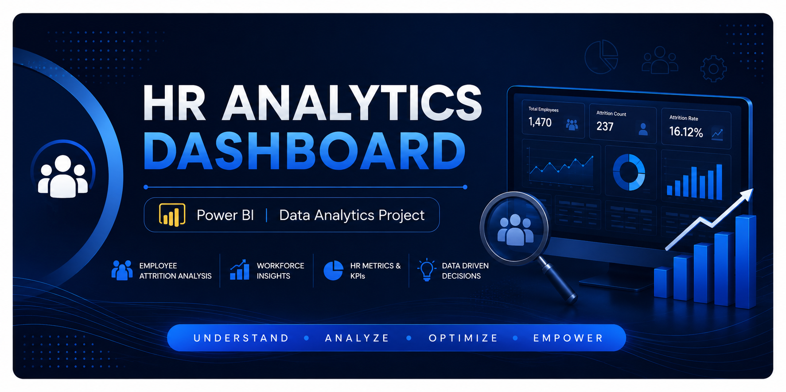
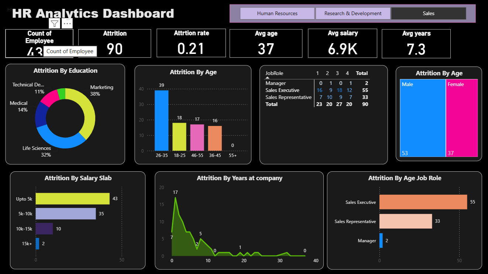

<p align="center">
  
</p>

<h1 align="center">📊 HR Analytics Dashboard</h1>

<p align="center">
An interactive HR Analytics Dashboard built using <strong>Power BI</strong> to analyze employee attrition, workforce demographics, salary trends, and HR performance metrics.
</p>

<p align="center">


</p>

---

# 📖 Table of Contents

- [Project Overview](#-project-overview)
- [Business Problem](#-business-problem)
- [Project Objectives](#-project-objectives)
- [Dashboard Preview](#-dashboard-preview)
- [Technology Stack](#-technology-stack)
- [Dashboard Features](#-dashboard-features)
- [Business Value](#-business-value)
- [Repository Structure](#-repository-structure)
- [How to Use](#-how-to-use)
- [Future Enhancements](#-future-enhancements)
- [Author](#-author)
- [License](#-license)

---

# 📌 Project Overview

The **HR Analytics Dashboard** is an interactive Power BI project developed to help Human Resource professionals analyze employee data and uncover workforce trends through meaningful visualizations.

The dashboard provides valuable insights into employee attrition, demographics, salary distribution, education, job roles, and years of service, enabling HR teams to make informed, data-driven decisions.

---

# 💼 Business Problem

Employee attrition is one of the biggest challenges faced by organizations.

Losing skilled employees increases recruitment costs, reduces productivity, and affects overall organizational performance.

This dashboard enables HR teams to monitor workforce trends, identify attrition patterns, and support strategic decision-making through interactive analytics.

---

# 🎯 Project Objectives

- Analyze employee attrition patterns.
- Monitor workforce demographics.
- Compare employee distribution across departments.
- Analyze salary and income trends.
- Study employee experience and tenure.
- Support HR decision-making using interactive dashboards.

---

# 🖼 Dashboard Preview

<p align="center">

</p>

---


# 🛠 Technology Stack

| Category | Technology |
|----------|------------|
| Dashboard | Power BI |
| Data Source | Microsoft Excel |
| Data Cleaning | Power Query |
| Calculations | DAX |
| Version Control | Git & GitHub |

---

# ✨ Dashboard Features

✔ Employee Attrition Analysis

✔ Department-wise Employee Analysis

✔ Gender Distribution

✔ Education-wise Attrition

✔ Salary Analysis

✔ Job Role Analysis

✔ Years at Company Analysis

✔ Interactive Filters & Slicers

✔ KPI Cards

✔ Dynamic Visualizations

---

# 📈 Dashboard Visualizations

The dashboard contains multiple interactive visuals including:

- KPI Cards
- Bar Charts
- Column Charts
- Donut Chart
- Treemap
- Area Chart
- Matrix/Table
- Interactive Slicers

These visualizations enable users to explore HR data efficiently and identify meaningful workforce trends.

---

# 💡 Business Value

This dashboard helps organizations:

- Monitor employee attrition.
- Identify departments requiring attention.
- Understand workforce demographics.
- Improve employee retention strategies.
- Support HR planning through data-driven insights.
- Simplify HR reporting using interactive visualizations.

---

# 📂 Repository Structure

```
HR-Analytics-Dashboard
│
├── Assets
├── DAX
├── Data
│   └── HR_Analytics_Data.xlsx
│
├── Documentation
├── GIF
├── Images
│   ├── Banner.png
│   └── Dashboard.png
│
├── PowerBI
│   └── HR_Analytics_Dashboard.pbix
│
├── README.md
├── LICENSE
└── .gitignore
```

---

# 🚀 How to Use

1. Clone this repository.

```
git clone https://github.com/Gita20049/HR-Analytics-Dashboard.git
```

2. Open the **PowerBI** folder.

3. Launch the `.pbix` file using **Power BI Desktop**.

4. Explore the dashboard using interactive filters and slicers.

---

# 📁 Project Files

| Folder | Description |
|---------|-------------|
| Data | HR dataset used in the dashboard |
| PowerBI | Power BI Dashboard (.pbix) |
| Images | Banner and dashboard screenshots |
| GIF | Dashboard demonstration GIF |
| Documentation | Project documentation |
| DAX | DAX measures and calculations |
| Assets | Additional project assets |

---

# 🔮 Future Enhancements

- Connect to SQL Database
- Real-time HR Analytics
- Predict Employee Attrition using Machine Learning
- Publish Dashboard to Power BI Service
- Add Drill-through Pages
- Advanced DAX Measures

---

# 🎓 Learning Outcomes

Through this project, I strengthened my understanding of:

- Power BI Dashboard Development
- Data Cleaning using Power Query
- DAX Calculations
- HR Data Analysis
- Business Intelligence
- Data Visualization Best Practices
- GitHub Portfolio Management

---

# 👩‍💻 Author

**Gitanjali Khochare**

Electronics & Telecommunication Engineering Student

Aspiring Data Analyst

**Skills**

- Power BI
- SQL
- Python
- Excel
- Data Analytics
- Git & GitHub

---

# 📜 License

This project is licensed under the **MIT License**.

Feel free to use this project for learning and educational purposes.

---

<p align="center">

⭐ If you found this project helpful, consider giving it a Star.

</p>
